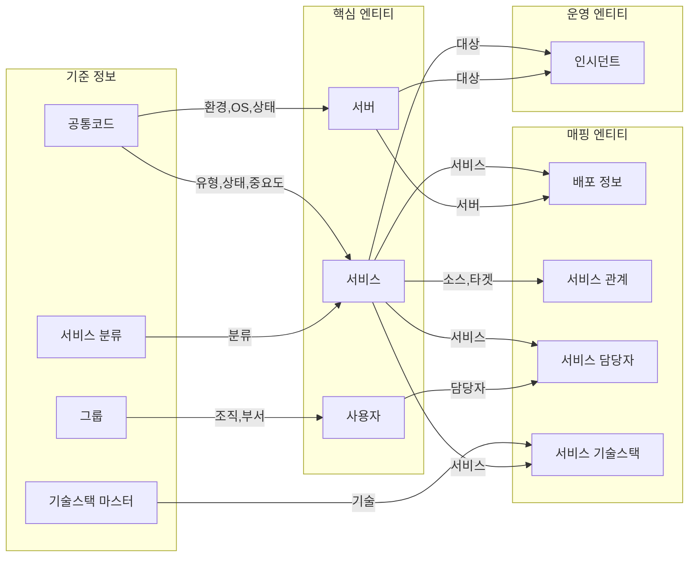
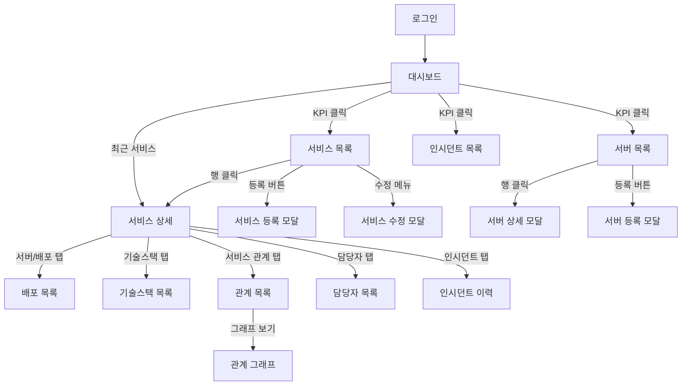

# ChainView 서비스별 데이터 명세서

> **문서 버전:** 1.0  
> **작성일:** 2026-05-31  
> **목적:** 각 서비스(기능)별 사용 데이터 및 서비스 간 연관관계 정의

---

## 목차
1. [서비스 관리](#1-서비스-관리)
2. [서비스 분류 관리](#2-서비스-분류-관리)
3. [기술스택 관리](#3-기술스택-관리)
4. [서버 관리](#4-서버-관리)
5. [배포 정보 관리](#5-배포-정보-관리)
6. [서비스 관계 관리](#6-서비스-관계-관리)
7. [사용자 관리](#7-사용자-관리)
8. [그룹 관리](#8-그룹-관리)
9. [서비스 담당자 관리](#9-서비스-담당자-관리)
10. [인시던트 관리](#10-인시던트-관리)
11. [공통코드 관리](#11-공통코드-관리)
12. [대시보드](#12-대시보드)
13. [서비스 간 연관관계 맵](#13-서비스-간-연관관계-맵)

---

## 1. 서비스 관리

> **관련 페이지:** services.html, service-detail.html  
> **연관 서비스:** 대시보드(KPI), 서비스 분류, 서비스 관계, 서비스 담당자, 인시던트, 배포 정보

### 1.1 서비스 등록

| 필드명 | 표시명 | 타입 | 필수 | 자동생성 | 설명 |
|--------|--------|------|------|----------|------|
| serviceCode | 서비스 코드 | string | ✅ | ❌ | 고유 식별자 (예: PAY-API-001), 사용자 입력 |
| serviceName | 서비스명 | string | ✅ | ❌ | 서비스 표시명 |
| categoryL1 | 대분류 | string | ✅ | ❌ | FK → 서비스 분류 (핵심 서비스, 부가 서비스 등) |
| categoryL2 | 중분류 | string | ❌ | ❌ | FK → 서비스 분류 |
| categoryL3 | 소분류 | string | ❌ | ❌ | FK → 서비스 분류 |
| serviceType | 서비스 유형 | enum | ✅ | ❌ | FK → 공통코드 (SERVICE_TYPE: API, WEB, BATCH) |
| importance | 중요도 | enum | ✅ | ❌ | FK → 공통코드 (IMPORTANCE: 높음, 중간, 낮음) |
| status | 상태 | enum | ✅ | ❌ | FK → 공통코드 (STATUS: 운영중, 테스트, 개발, 중지) |
| endpointUrl | 엔드포인트 URL | string | ❌ | ❌ | 서비스 접근 URL |
| description | 설명 | text | ❌ | ❌ | 서비스 상세 설명 |
| createdAt | 등록일 | datetime | ✅ | ✅ | 시스템 자동 생성 |
| createdBy | 등록자 | string | ✅ | ✅ | 로그인 사용자 자동 설정 |

**입력 소스:**
- categoryL1/L2/L3: 서비스 분류 관리에서 등록된 분류 선택 (드롭다운/트리)
- serviceType, importance, status: 공통코드 관리에서 등록된 코드 선택

---

### 1.2 서비스 수정

| 필드명 | 표시명 | 수정가능 | 비고 |
|--------|--------|----------|------|
| serviceCode | 서비스 코드 | ❌ | PK, 수정 불가 |
| serviceName | 서비스명 | ✅ | |
| categoryL1 | 대분류 | ✅ | |
| categoryL2 | 중분류 | ✅ | |
| categoryL3 | 소분류 | ✅ | |
| serviceType | 서비스 유형 | ✅ | |
| importance | 중요도 | ✅ | |
| status | 상태 | ✅ | |
| endpointUrl | 엔드포인트 URL | ✅ | |
| description | 설명 | ✅ | |
| updatedAt | 수정일 | - | 시스템 자동 갱신 |
| updatedBy | 수정자 | - | 로그인 사용자 자동 설정 |

---

### 1.3 서비스 삭제

| 항목 | 설명 |
|------|------|
| 삭제 조건 | 연결된 배포 정보, 서비스 관계, 담당자, 인시던트 확인 필요 |
| 삭제 방식 | 논리 삭제 권장 (status → '삭제됨' 또는 isDeleted 플래그) |
| 연관 데이터 처리 | 서비스 관계에서 해당 서비스 참조 해제 필요 |

---

### 1.4 서비스 목록 조회

| 필드명 | 표시명 | 필터 | 정렬 | 비고 |
|--------|--------|------|------|------|
| serviceCode | 서비스 코드 | ✅ 검색 | ✅ | |
| serviceName | 서비스명 | ✅ 검색 | ✅ | |
| categoryL1 | 분류 | ✅ 트리필터 | ✅ | 대분류 > 중분류 > 소분류 표시 |
| serverHost | 서버/호스트 | ❌ | ❌ | 배포 정보에서 조인 |
| serviceType | 유형 | ✅ 드롭다운 | ✅ | |
| importance | 중요도 | ✅ 드롭다운 | ✅ | |
| status | 상태 | ✅ 드롭다운 | ✅ | |
| dataCompleteness | 데이터 완성도 | ✅ 드롭다운 | ❌ | 계산 필드 (담당자/관계 등록 여부) |

**데이터 완성도 계산 로직:**
- `완료`: 담당자 지정 ✅, 서비스 관계 등록 ✅
- `담당자 미지정`: 담당자 = null
- `관계 미등록`: 서비스 관계 count = 0

---

### 1.5 서비스 상세 조회

| 탭 | 표시 데이터 | 데이터 소스 |
|----|-------------|-------------|
| 기본정보 | 서비스 속성 전체 | SERVICE 테이블 |
| 서버/배포 | 배포된 서버 목록 | SERVICE_DEPLOYMENT + SERVER |
| 기술스택 | 적용 기술 목록 | SERVICE_TECH_STACK + TECH_STACK_MASTER |
| 서비스 관계 | 호출/피호출 서비스 | SERVICE_RELATION |
| 담당자/그룹 | 담당자 정보 | SERVICE_OWNER + USER |
| 인시던트 이력 | 관련 장애 목록 | INCIDENT (targetId = serviceCode) |
| 변경 이력 | 수정 히스토리 | SERVICE_HISTORY (별도 이력 테이블) |

---

## 2. 서비스 분류 관리

> **관련 페이지:** service-categories.html  
> **연관 서비스:** 서비스 관리 (분류 필터/선택에 사용)

### 2.1 서비스 분류 등록

| 필드명 | 표시명 | 타입 | 필수 | 자동생성 | 설명 |
|--------|--------|------|------|----------|------|
| categoryCode | 분류 코드 | string | ✅ | ❌ | 고유 식별자 |
| categoryName | 분류명 | string | ✅ | ❌ | 표시명 |
| level | 레벨 | number | ✅ | ✅ | 1=대분류, 2=중분류, 3=소분류 |
| parentCode | 상위 분류 코드 | string | ❌ | ❌ | FK → 자기참조 (대분류는 null) |
| sortOrder | 정렬순서 | number | ❌ | ❌ | 동일 레벨 내 순서 |
| isActive | 사용여부 | boolean | ✅ | ✅ | 기본값: true |

**계층 구조 예시:**
```
핵심 서비스 (L1)
├── 결제 (L2)
│   ├── 결제 API (L3)
│   └── 정산 (L3)
├── 회원 (L2)
└── 주문 (L2)
```

---

### 2.2 서비스 분류 수정

| 필드명 | 표시명 | 수정가능 | 비고 |
|--------|--------|----------|------|
| categoryCode | 분류 코드 | ❌ | PK, 수정 불가 |
| categoryName | 분류명 | ✅ | |
| parentCode | 상위 분류 | ✅ | 변경 시 하위 분류도 이동 |
| sortOrder | 정렬순서 | ✅ | |
| isActive | 사용여부 | ✅ | 비활성화 시 서비스 등록에서 선택 불가 |

---

### 2.3 서비스 분류 삭제

| 항목 | 설명 |
|------|------|
| 삭제 조건 | 하위 분류 없음 AND 해당 분류 사용 서비스 없음 |
| 삭제 방식 | 물리 삭제 또는 논리 삭제 (isActive = false) |

---

## 3. 기술스택 관리

> **관련 페이지:** tech-stacks.html  
> **연관 서비스:** 서비스 관리 (서비스 상세 > 기술스택 탭)

### 3.1 기술스택 마스터 등록

| 필드명 | 표시명 | 타입 | 필수 | 자동생성 | 설명 |
|--------|--------|------|------|----------|------|
| id | ID | number | ✅ | ✅ | Auto Increment |
| techType | 기술 유형 | enum | ✅ | ❌ | 언어, 프레임워크, 데이터베이스, 메시지큐 등 |
| techName | 기술명 | string | ✅ | ❌ | Java, Spring Boot, MySQL 등 |
| defaultVersion | 기본 버전 | string | ❌ | ❌ | 권장 버전 |
| isActive | 사용여부 | boolean | ✅ | ✅ | 기본값: true |

---

### 3.2 서비스 기술스택 매핑 등록

| 필드명 | 표시명 | 타입 | 필수 | 자동생성 | 설명 |
|--------|--------|------|------|----------|------|
| id | ID | number | ✅ | ✅ | Auto Increment |
| serviceCode | 서비스 코드 | string | ✅ | ❌ | FK → SERVICE |
| techStackId | 기술스택 ID | number | ✅ | ❌ | FK → TECH_STACK_MASTER |
| appliedVersion | 적용 버전 | string | ❌ | ❌ | 실제 적용 버전 |
| notes | 비고 | string | ❌ | ❌ | 추가 설명 |

---

## 4. 서버 관리

> **관련 페이지:** servers.html  
> **연관 서비스:** 배포 정보, 대시보드(KPI), 인시던트

### 4.1 서버 등록

| 필드명 | 표시명 | 타입 | 필수 | 자동생성 | 설명 |
|--------|--------|------|------|----------|------|
| serverName | 서버명 | string | ✅ | ❌ | 고유 식별자 |
| hostname | 호스트명 | string | ✅ | ❌ | FQDN 또는 호스트명 (UK) |
| ipAddress | IP 주소 | string | ✅ | ❌ | IPv4 또는 IPv6 |
| environment | 환경 | enum | ✅ | ❌ | FK → 공통코드 (ENVIRONMENT: Production, Test, Development) |
| osType | OS 유형 | string | ✅ | ❌ | FK → 공통코드 (OS_TYPE: Linux, Windows 등) |
| osVersion | OS 버전 | string | ❌ | ❌ | CentOS 7.9, Windows Server 2019 등 |
| status | 상태 | enum | ✅ | ❌ | FK → 공통코드 (STATUS: 운영중, 테스트, 개발, 중지) |
| createdAt | 등록일 | datetime | ✅ | ✅ | 시스템 자동 생성 |

**입력 소스:**
- environment, osType, status: 공통코드 관리에서 등록된 코드 선택

---

### 4.2 서버 수정

| 필드명 | 표시명 | 수정가능 | 비고 |
|--------|--------|----------|------|
| serverName | 서버명 | ❌ | PK, 수정 불가 |
| hostname | 호스트명 | ✅ | UK, 중복 체크 필요 |
| ipAddress | IP 주소 | ✅ | |
| environment | 환경 | ✅ | |
| osType | OS 유형 | ✅ | |
| osVersion | OS 버전 | ✅ | |
| status | 상태 | ✅ | |

---

### 4.3 서버 삭제

| 항목 | 설명 |
|------|------|
| 삭제 조건 | 배포된 서비스 없음 (SERVICE_DEPLOYMENT 참조 없음) |
| 삭제 방식 | 논리 삭제 권장 (status → '삭제됨') |

---

### 4.4 서버 목록 조회

| 필드명 | 표시명 | 필터 | 정렬 | 비고 |
|--------|--------|------|------|------|
| serverName | 서버명 | ✅ 검색 | ✅ | |
| hostname | 호스트명 | ✅ 검색 | ✅ | |
| ipAddress | IP 주소 | ✅ 검색 | ❌ | |
| environment | 환경 | ✅ 뱃지필터 | ✅ | Production/Test/Development |
| osType | OS 유형 | ✅ 드롭다운 | ✅ | |
| status | 상태 | ✅ 드롭다운 | ✅ | |
| connectedServiceCount | 연결 서비스 | ❌ | ✅ | 계산 필드 (SERVICE_DEPLOYMENT count) |

---

### 4.5 서버 상세 조회 (모달)

| 섹션 | 표시 데이터 | 데이터 소스 |
|------|-------------|-------------|
| 서버 정보 | 서버 속성 전체 | SERVER 테이블 |
| 연결된 서비스 목록 | 배포된 서비스 리스트 | SERVICE_DEPLOYMENT + SERVICE |

---

## 5. 배포 정보 관리

> **관련 페이지:** deployments.html  
> **연관 서비스:** 서비스 관리, 서버 관리

### 5.1 배포 정보 등록

| 필드명 | 표시명 | 타입 | 필수 | 자동생성 | 설명 |
|--------|--------|------|------|----------|------|
| id | ID | number | ✅ | ✅ | Auto Increment |
| serviceCode | 서비스 | string | ✅ | ❌ | FK → SERVICE (드롭다운 선택) |
| serverName | 서버 | string | ✅ | ❌ | FK → SERVER (드롭다운 선택) |
| deployPath | 배포 경로 | string | ❌ | ❌ | /app/services/pay-api 등 |
| port | 포트 | number | ❌ | ❌ | 8080 등 |
| instanceCount | 인스턴스 수 | number | ❌ | ❌ | 기본값: 1 |
| status | 상태 | enum | ✅ | ❌ | Running, Stopped, Deploying 등 |
| createdAt | 등록일 | datetime | ✅ | ✅ | |

**복합 유니크 제약:** (serviceCode, serverName) 조합 유니크

---

### 5.2 배포 정보 수정

| 필드명 | 표시명 | 수정가능 | 비고 |
|--------|--------|----------|------|
| serviceCode | 서비스 | ❌ | 복합 PK 일부 |
| serverName | 서버 | ❌ | 복합 PK 일부 |
| deployPath | 배포 경로 | ✅ | |
| port | 포트 | ✅ | |
| instanceCount | 인스턴스 수 | ✅ | |
| status | 상태 | ✅ | |

---

### 5.3 배포 정보 삭제

| 항목 | 설명 |
|------|------|
| 삭제 조건 | 즉시 삭제 가능 |
| 삭제 방식 | 물리 삭제 |
| 영향 | 서비스 상세 > 서버/배포 탭에서 제거됨 |

---

## 6. 서비스 관계 관리

> **관련 페이지:** service-relations.html, relation-graph.html  
> **연관 서비스:** 서비스 관리, 대시보드, 인시던트 영향도 분석

### 6.1 서비스 관계 등록

| 필드명 | 표시명 | 타입 | 필수 | 자동생성 | 설명 |
|--------|--------|------|------|----------|------|
| id | ID | number | ✅ | ✅ | Auto Increment |
| sourceServiceCode | 호출 서비스 | string | ✅ | ❌ | FK → SERVICE (From) |
| targetServiceCode | 대상 서비스 | string | ✅ | ❌ | FK → SERVICE (To) |
| relationType | 관계 유형 | enum | ✅ | ❌ | API 호출, DB 접근, 메시지 구독, 파일 참조 등 |
| connectionStatus | 연결 상태 | enum | ✅ | ❌ | 정상, 지연, 장애 |
| isRequired | 필수 여부 | boolean | ✅ | ❌ | 장애 시 영향도 판단용 |
| description | 설명 | string | ❌ | ❌ | 관계 상세 설명 |
| createdAt | 등록일 | datetime | ✅ | ✅ | |

**복합 유니크 제약:** (sourceServiceCode, targetServiceCode, relationType)

**자기 참조 방지:** sourceServiceCode ≠ targetServiceCode

---

### 6.2 서비스 관계 수정

| 필드명 | 표시명 | 수정가능 | 비고 |
|--------|--------|----------|------|
| sourceServiceCode | 호출 서비스 | ❌ | |
| targetServiceCode | 대상 서비스 | ❌ | |
| relationType | 관계 유형 | ✅ | |
| connectionStatus | 연결 상태 | ✅ | |
| isRequired | 필수 여부 | ✅ | |
| description | 설명 | ✅ | |

---

### 6.3 서비스 관계 삭제

| 항목 | 설명 |
|------|------|
| 삭제 조건 | 즉시 삭제 가능 |
| 삭제 방식 | 물리 삭제 |
| 영향 | 관계 그래프에서 연결선 제거 |

---

### 6.4 관계 그래프 조회

| 데이터 | 설명 | 소스 |
|--------|------|------|
| 노드 | 서비스 목록 | SERVICE |
| 엣지 | 서비스 간 연결 | SERVICE_RELATION |
| 중심 노드 | 선택된 서비스 | 사용자 선택 |
| 수신 관계 | 해당 서비스를 호출하는 서비스 | targetServiceCode = 선택 서비스 |
| 송신 관계 | 해당 서비스가 호출하는 서비스 | sourceServiceCode = 선택 서비스 |

---

## 7. 사용자 관리

> **관련 페이지:** users.html  
> **연관 서비스:** 로그인, 서비스 담당자, 대시보드(KPI: 비활성 사용자)

### 7.1 사용자 등록

| 필드명 | 표시명 | 타입 | 필수 | 자동생성 | 설명 |
|--------|--------|------|------|----------|------|
| employeeNo | 사번 | string | ✅ | ❌ | PK, 고유 식별자 |
| name | 이름 | string | ✅ | ❌ | |
| organizationId | 조직 | string | ✅ | ❌ | FK → GROUP (조직 레벨) |
| departmentId | 부서 | string | ✅ | ❌ | FK → GROUP (부서 레벨) |
| role | 역할 | string | ❌ | ❌ | 직책/담당업무 |
| phone | 연락처 | string | ❌ | ❌ | |
| email | 이메일 | string | ✅ | ❌ | UK, 중복 불가 |
| isActive | 활성 상태 | boolean | ✅ | ✅ | 기본값: true |
| createdAt | 등록일 | datetime | ✅ | ✅ | |

---

### 7.2 사용자 수정

| 필드명 | 표시명 | 수정가능 | 비고 |
|--------|--------|----------|------|
| employeeNo | 사번 | ❌ | PK, 수정 불가 |
| name | 이름 | ✅ | |
| organizationId | 조직 | ✅ | |
| departmentId | 부서 | ✅ | |
| role | 역할 | ✅ | |
| phone | 연락처 | ✅ | |
| email | 이메일 | ✅ | UK, 중복 체크 |
| isActive | 활성 상태 | ✅ | 비활성화 시 로그인 차단 |

---

### 7.3 사용자 삭제

| 항목 | 설명 |
|------|------|
| 삭제 조건 | 서비스 담당자로 지정된 경우 해제 필요 |
| 삭제 방식 | 논리 삭제 (isActive = false) |
| 영향 | 대시보드 비활성 사용자 KPI 증가 |

---

## 8. 그룹 관리

> **관련 페이지:** groups.html  
> **연관 서비스:** 사용자 관리 (조직/부서 선택), 서비스 담당자

### 8.1 그룹 등록

| 필드명 | 표시명 | 타입 | 필수 | 자동생성 | 설명 |
|--------|--------|------|------|----------|------|
| id | ID | number | ✅ | ✅ | Auto Increment |
| groupName | 그룹명 | string | ✅ | ❌ | |
| groupType | 그룹 유형 | enum | ✅ | ❌ | 조직, 부서, 팀 등 |
| parentGroupId | 상위 그룹 | number | ❌ | ❌ | FK → 자기참조 |
| sortOrder | 정렬순서 | number | ❌ | ❌ | |
| isActive | 사용여부 | boolean | ✅ | ✅ | 기본값: true |

---

### 8.2 그룹 수정

| 필드명 | 표시명 | 수정가능 | 비고 |
|--------|--------|----------|------|
| id | ID | ❌ | PK |
| groupName | 그룹명 | ✅ | |
| groupType | 그룹 유형 | ✅ | |
| parentGroupId | 상위 그룹 | ✅ | 순환 참조 방지 필요 |
| sortOrder | 정렬순서 | ✅ | |
| isActive | 사용여부 | ✅ | |

---

### 8.3 그룹 삭제

| 항목 | 설명 |
|------|------|
| 삭제 조건 | 하위 그룹 없음 AND 소속 사용자 없음 |
| 삭제 방식 | 논리 삭제 (isActive = false) |

---

## 9. 서비스 담당자 관리

> **관련 페이지:** service-owners.html  
> **연관 서비스:** 서비스 관리, 사용자 관리, 대시보드(KPI: 미지정 담당 서비스)

### 9.1 서비스 담당자 등록

| 필드명 | 표시명 | 타입 | 필수 | 자동생성 | 설명 |
|--------|--------|------|------|----------|------|
| id | ID | number | ✅ | ✅ | Auto Increment |
| serviceCode | 서비스 | string | ✅ | ❌ | FK → SERVICE |
| employeeNo | 담당자 | string | ✅ | ❌ | FK → USER |
| ownerRole | 담당 역할 | enum | ✅ | ❌ | 주담당자, 부담당자, 개발자, 운영자 등 |
| startDate | 담당 시작일 | date | ❌ | ❌ | |
| endDate | 담당 종료일 | date | ❌ | ❌ | null이면 현재 담당중 |
| createdAt | 등록일 | datetime | ✅ | ✅ | |

**복합 유니크 제약:** (serviceCode, employeeNo, ownerRole)

---

### 9.2 서비스 담당자 수정

| 필드명 | 표시명 | 수정가능 | 비고 |
|--------|--------|----------|------|
| serviceCode | 서비스 | ❌ | |
| employeeNo | 담당자 | ❌ | |
| ownerRole | 담당 역할 | ✅ | |
| startDate | 담당 시작일 | ✅ | |
| endDate | 담당 종료일 | ✅ | 설정 시 담당 이력으로 전환 |

---

### 9.3 서비스 담당자 삭제

| 항목 | 설명 |
|------|------|
| 삭제 조건 | 즉시 삭제 가능 |
| 삭제 방식 | 물리 삭제 또는 endDate 설정 |
| 영향 | 서비스 상세 > 담당자 탭에서 제거, 데이터 완성도 변경 |

---

## 10. 인시던트 관리

> **관련 페이지:** incidents.html  
> **연관 서비스:** 서비스 관리, 서버 관리, 대시보드(KPI: OPEN 인시던트)

### 10.1 인시던트 등록

| 필드명 | 표시명 | 타입 | 필수 | 자동생성 | 설명 |
|--------|--------|------|------|----------|------|
| id | 인시던트 ID | number | ✅ | ✅ | Auto Increment |
| incidentType | 유형 | enum | ✅ | ❌ | 서비스 장애, 서버 장애 |
| severity | 심각도 | enum | ✅ | ❌ | CRITICAL, HIGH, MEDIUM, LOW, NOTICE |
| status | 상태 | enum | ✅ | ❌ | OPEN, IN_PROGRESS, RESOLVED, CLOSED |
| targetType | 대상 유형 | enum | ✅ | ❌ | SERVICE, SERVER |
| targetId | 대상 ID | string | ✅ | ❌ | FK → SERVICE 또는 SERVER |
| title | 제목 | string | ✅ | ❌ | 인시던트 요약 |
| description | 상세 내용 | text | ❌ | ❌ | |
| affectedServices | 영향 서비스 수 | number | ❌ | ✅ | 계산 필드 (서비스 관계 기반) |
| occurredAt | 발생 일시 | datetime | ✅ | ❌ | 사용자 입력 |
| resolvedAt | 종료 일시 | datetime | ❌ | ❌ | 해결 시 입력 |
| createdBy | 등록자 | string | ✅ | ✅ | 로그인 사용자 |
| createdAt | 등록일 | datetime | ✅ | ✅ | |

**영향 서비스 자동 계산:**
- targetType = SERVICE인 경우: SERVICE_RELATION에서 해당 서비스를 참조하는 서비스 count
- targetType = SERVER인 경우: 해당 서버에 배포된 서비스 count (SERVICE_DEPLOYMENT)

---

### 10.2 인시던트 수정

| 필드명 | 표시명 | 수정가능 | 비고 |
|--------|--------|----------|------|
| id | 인시던트 ID | ❌ | PK |
| incidentType | 유형 | ✅ | |
| severity | 심각도 | ✅ | |
| status | 상태 | ✅ | OPEN → IN_PROGRESS → RESOLVED → CLOSED |
| targetType | 대상 유형 | ❌ | |
| targetId | 대상 ID | ❌ | |
| title | 제목 | ✅ | |
| description | 상세 내용 | ✅ | |
| resolvedAt | 종료 일시 | ✅ | status = RESOLVED/CLOSED 시 설정 |

---

### 10.3 인시던트 삭제

| 항목 | 설명 |
|------|------|
| 삭제 조건 | 일반적으로 삭제 불가 (이력 보존) |
| 삭제 방식 | 논리 삭제 또는 status = CLOSED로 처리 |

---

### 10.4 인시던트 목록 조회

| 필드명 | 표시명 | 필터 | 정렬 | 비고 |
|--------|--------|------|------|------|
| id | ID | ✅ 검색 | ✅ | |
| incidentType | 유형 | ✅ 드롭다운 | ✅ | |
| severity | 심각도 | ✅ 뱃지필터 | ✅ | CRITICAL ~ NOTICE |
| status | 상태 | ✅ 뱃지필터 | ✅ | OPEN, RESOLVED 등 |
| targetId | 대상 | ✅ 드롭다운 | ❌ | 서비스/서버 선택 |
| title | 제목 | ✅ 검색 | ❌ | |
| affectedServices | 영향 서비스 | ❌ | ✅ | |
| occurredAt | 발생 일시 | ✅ 기간필터 | ✅ | |
| resolvedAt | 종료 일시 | ✅ 기간필터 | ✅ | |

---

## 11. 공통코드 관리

> **관련 페이지:** common-codes.html  
> **연관 서비스:** 모든 서비스 (드롭다운 선택 옵션 제공)

### 11.1 공통코드 등록

| 필드명 | 표시명 | 타입 | 필수 | 자동생성 | 설명 |
|--------|--------|------|------|----------|------|
| codeGroup | 코드 그룹 | string | ✅ | ❌ | PK (복합), SERVICE_TYPE, STATUS 등 |
| itemCode | 코드 | string | ✅ | ❌ | PK (복합), 실제 저장값 |
| codeName | 코드명 | string | ✅ | ❌ | 화면 표시명 |
| sortOrder | 정렬순서 | number | ❌ | ❌ | 동일 그룹 내 순서 |
| isActive | 사용여부 | boolean | ✅ | ✅ | 기본값: true |
| notes | 비고 | string | ❌ | ❌ | |

**코드 그룹 목록:**
| 그룹 코드 | 그룹명 | 사용처 |
|-----------|--------|--------|
| SERVICE_TYPE | 서비스 유형 | 서비스 등록 |
| IMPORTANCE | 중요도 | 서비스 등록 |
| STATUS | 상태 | 서비스, 서버 등 |
| ENVIRONMENT | 환경 | 서버 등록 |
| OS_TYPE | OS 유형 | 서버 등록 |
| RELATION_TYPE | 관계 유형 | 서비스 관계 |
| INCIDENT_TYPE | 인시던트 유형 | 인시던트 등록 |
| SEVERITY | 심각도 | 인시던트 등록 |
| TECH_TYPE | 기술 유형 | 기술스택 마스터 |

---

### 11.2 공통코드 수정

| 필드명 | 표시명 | 수정가능 | 비고 |
|--------|--------|----------|------|
| codeGroup | 코드 그룹 | ❌ | PK |
| itemCode | 코드 | ❌ | PK |
| codeName | 코드명 | ✅ | |
| sortOrder | 정렬순서 | ✅ | |
| isActive | 사용여부 | ✅ | 비활성화 시 선택 불가 |
| notes | 비고 | ✅ | |

---

### 11.3 공통코드 삭제

| 항목 | 설명 |
|------|------|
| 삭제 조건 | 해당 코드 사용 데이터 없음 |
| 삭제 방식 | 논리 삭제 (isActive = false) 권장 |
| 영향 | 비활성화 시 해당 코드 선택 불가 |

---

## 12. 대시보드

> **관련 페이지:** dashboard.html  
> **연관 서비스:** 모든 서비스 (집계 데이터 표시)

### 12.1 KPI 카드

| KPI | 계산 로직 | 데이터 소스 | 링크 |
|-----|-----------|-------------|------|
| 전체 서비스 | COUNT(*) FROM SERVICE WHERE isDeleted = false | SERVICE | services.html |
| 운영중 서비스 | COUNT(*) FROM SERVICE WHERE status = '운영중' | SERVICE | services.html?status=운영중 |
| 등록 서버 | COUNT(*) FROM SERVER WHERE isDeleted = false | SERVER | servers.html |
| OPEN 인시던트 | COUNT(*) FROM INCIDENT WHERE status = 'OPEN' | INCIDENT | incidents.html?status=OPEN |
| 미지정 담당 서비스 | 서비스 중 SERVICE_OWNER에 매핑 없는 수 | SERVICE LEFT JOIN SERVICE_OWNER | services.html?dataCompleteness=담당자미지정 |
| 비활성 사용자 | COUNT(*) FROM USER WHERE isActive = false | USER | users.html?isActive=false |

### 12.2 최근 등록/수정 서비스

| 필드 | 설명 | 정렬 |
|------|------|------|
| serviceName | 서비스명 | |
| updatedAt | 최종 수정일 | DESC |
| updater | 수정자 | |

**조회 조건:** ORDER BY updatedAt DESC LIMIT 5

### 12.3 최근 인시던트

| 필드 | 설명 | 정렬 |
|------|------|------|
| severity | 심각도 | |
| title | 제목 | |
| status | 상태 | |
| occurredAt | 발생일 | DESC |

**조회 조건:** ORDER BY occurredAt DESC LIMIT 5

### 12.4 데이터 품질 체크

| 체크 항목 | 로직 | 심각도 |
|-----------|------|--------|
| 담당자 미지정 서비스 | COUNT(SERVICE) - COUNT(SERVICE_OWNER DISTINCT serviceCode) | 중간 |
| 관계 미등록 서비스 | SERVICE NOT IN SERVICE_RELATION (source OR target) | 낮음 |
| 기술스택 미등록 서비스 | SERVICE NOT IN SERVICE_TECH_STACK | 낮음 |

---

## 13. 서비스 간 연관관계 맵

### 13.1 데이터 참조 관계



### 13.2 화면 간 네비게이션 관계



### 13.3 공통코드 의존 관계

| 사용 서비스 | 코드 그룹 | 용도 |
|-------------|-----------|------|
| 서비스 관리 | SERVICE_TYPE | 서비스 유형 선택 |
| 서비스 관리 | IMPORTANCE | 중요도 선택 |
| 서비스 관리 | STATUS | 상태 선택 |
| 서버 관리 | ENVIRONMENT | 환경 선택 |
| 서버 관리 | OS_TYPE | OS 유형 선택 |
| 서버 관리 | STATUS | 상태 선택 |
| 서비스 관계 관리 | RELATION_TYPE | 관계 유형 선택 |
| 인시던트 관리 | INCIDENT_TYPE | 인시던트 유형 선택 |
| 인시던트 관리 | SEVERITY | 심각도 선택 |
| 기술스택 관리 | TECH_TYPE | 기술 유형 선택 |

### 13.4 엔티티별 CRUD 영향도 매트릭스

| 엔티티 | 등록 시 영향 | 수정 시 영향 | 삭제 시 영향 |
|--------|-------------|-------------|-------------|
| **서비스** | 대시보드 KPI 갱신 | 관련 화면 갱신 | 배포/관계/담당자/인시던트 확인 필요 |
| **서버** | 대시보드 KPI 갱신 | 관련 화면 갱신 | 배포 정보 확인 필요 |
| **사용자** | - | 담당자 정보 갱신 | 담당자 매핑 해제 필요 |
| **서비스 분류** | - | 서비스 분류 표시 갱신 | 하위 분류/서비스 확인 필요 |
| **공통코드** | - | 선택 옵션 갱신 | 사용중인 데이터 확인 필요 |
| **서비스 관계** | 관계 그래프 갱신, 데이터 완성도 갱신 | 그래프 갱신 | 그래프에서 제거 |
| **서비스 담당자** | 데이터 완성도 갱신, 대시보드 KPI 갱신 | - | 데이터 완성도 갱신 |
| **인시던트** | 대시보드 KPI 갱신 | 상태 변경 시 KPI 갱신 | - |

---

## 부록: 필드 검증 규칙

### A. 문자열 필드

| 필드 유형 | 최소 길이 | 최대 길이 | 패턴 |
|-----------|-----------|-----------|------|
| 서비스 코드 | 3 | 50 | 영문대문자, 숫자, 하이픈 |
| 서버명 | 3 | 100 | 영문, 숫자, 하이픈, 언더스코어 |
| 호스트명 | 3 | 255 | FQDN 형식 |
| IP 주소 | 7 | 45 | IPv4/IPv6 형식 |
| 이메일 | 5 | 255 | 이메일 형식 |
| 사번 | 1 | 20 | 영문, 숫자 |

### B. 필수 필드 요약

| 엔티티 | 필수 필드 |
|--------|-----------|
| SERVICE | serviceCode, serviceName, categoryL1, serviceType, importance, status |
| SERVER | serverName, hostname, ipAddress, environment, osType, status |
| USER | employeeNo, name, organizationId, departmentId, email |
| INCIDENT | incidentType, severity, status, targetType, targetId, title, occurredAt |
| COMMON_CODE | codeGroup, itemCode, codeName |

---

*본 문서는 ChainView 서비스별 데이터 명세 및 연관관계를 정의합니다.*
