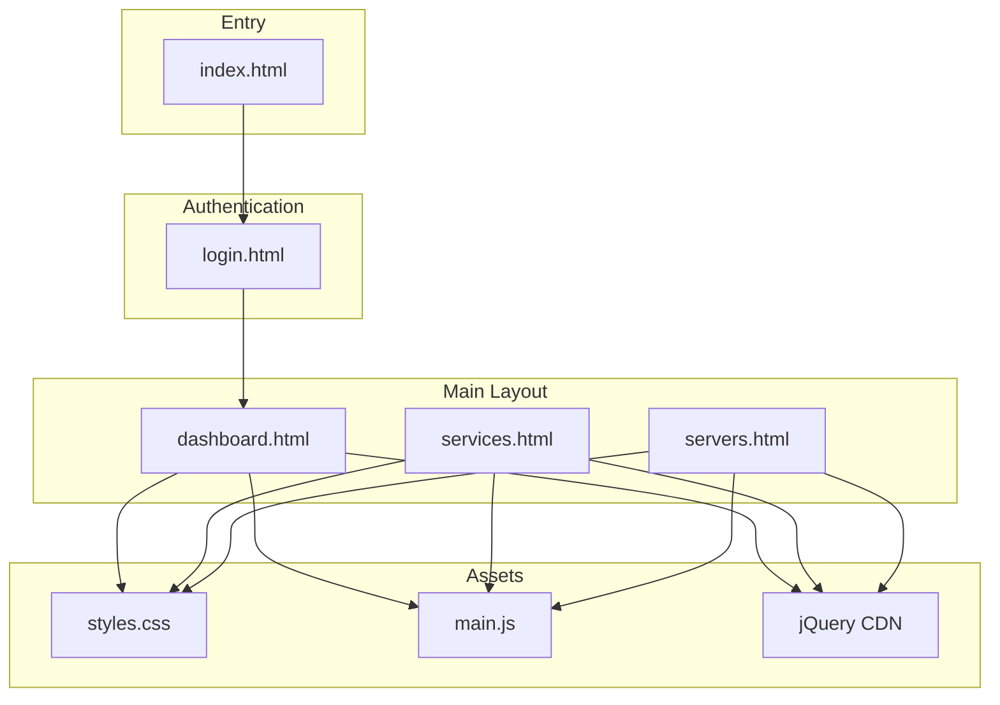
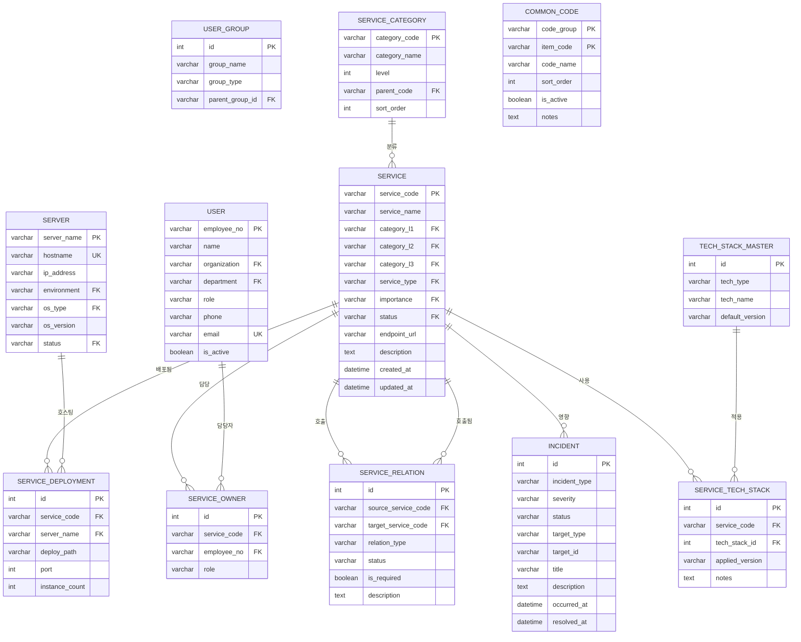
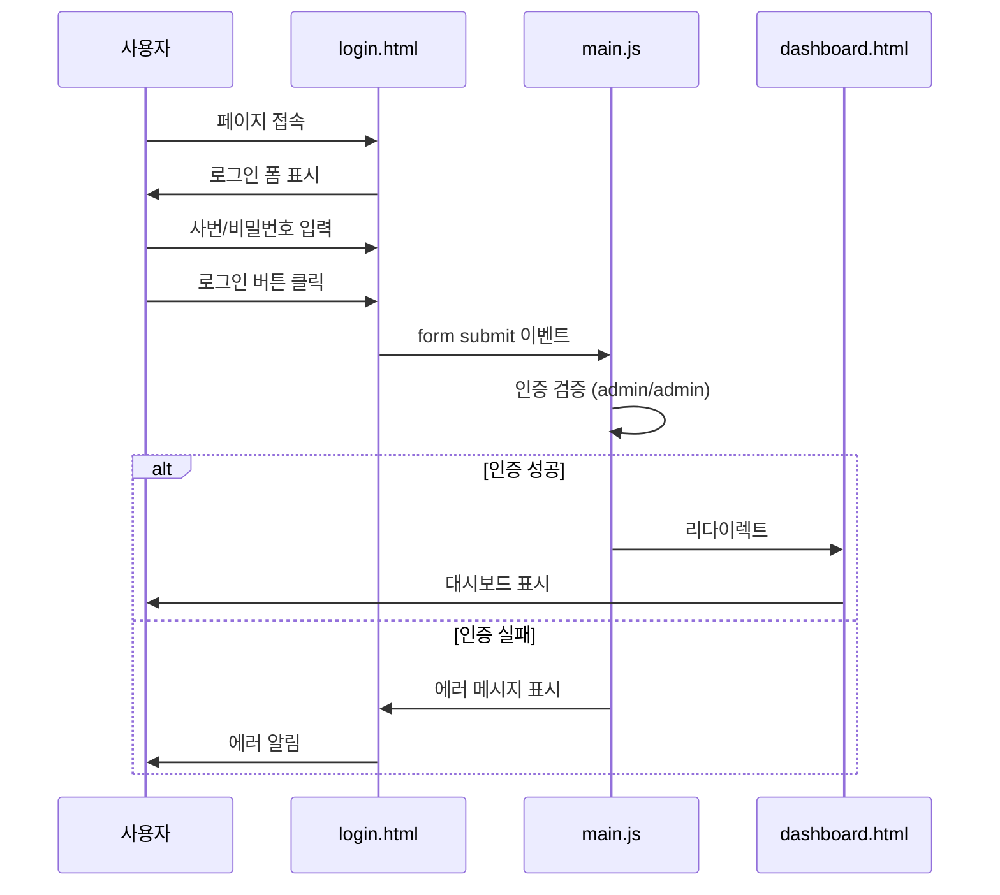
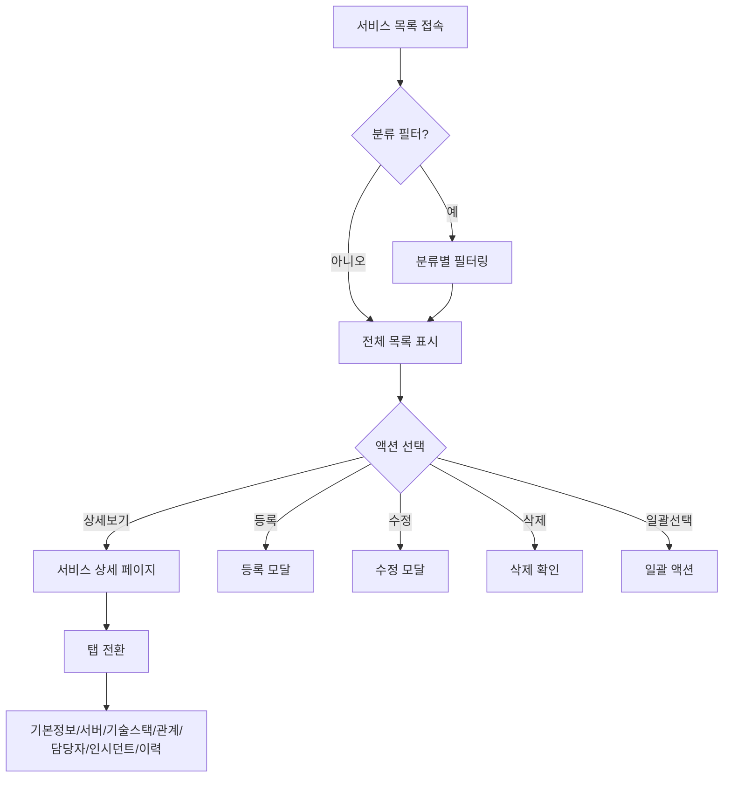
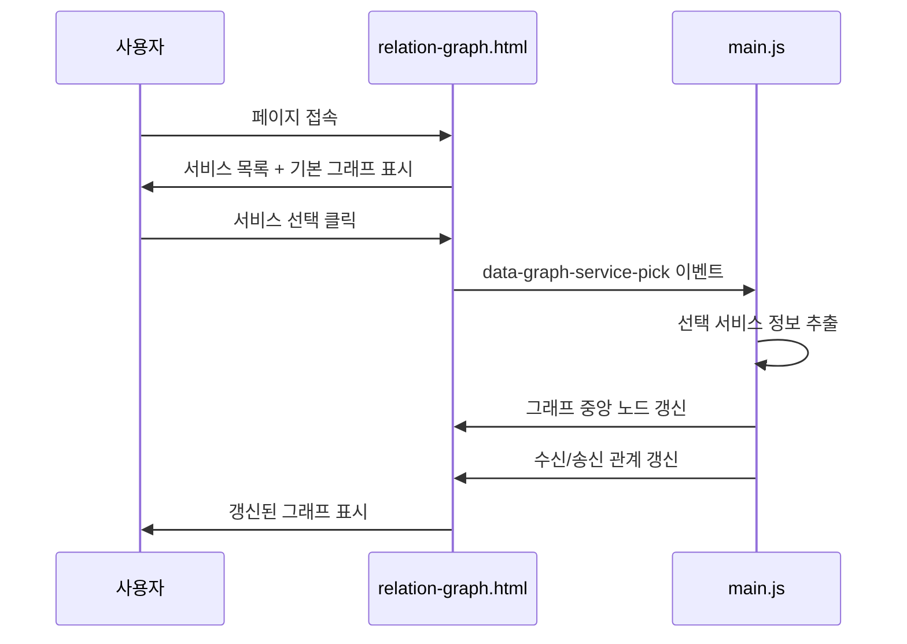
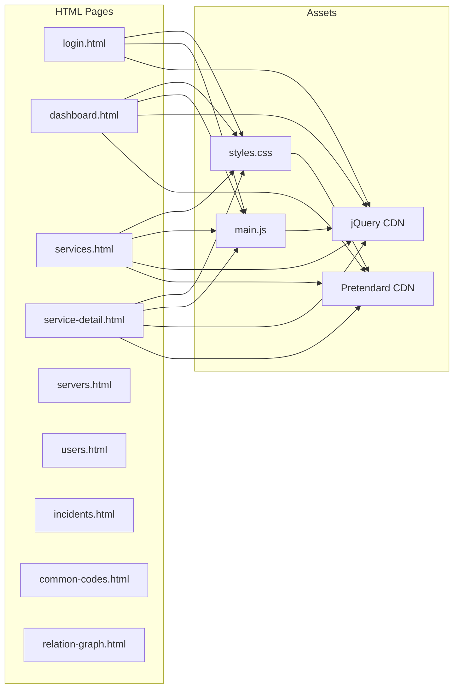
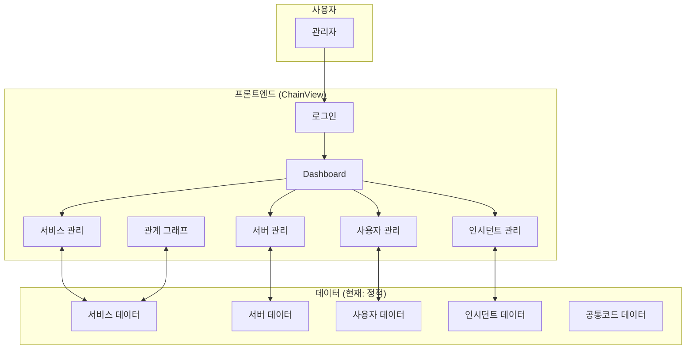

# ChainView 기술 문서

> **문서 버전:** 1.0  
> **작성일:** 2026-05-31  
> **분석 대상:** ChainView Admin Console (정적 HTML/CSS/JS 프로젝트)

---

## 목차
1. [프로젝트 개요](#1-프로젝트-개요)
2. [디렉토리 구조 분석](#2-디렉토리-구조-분석)
3. [서비스(페이지) 분석](#3-서비스페이지-분석)
4. [데이터 모델 분석](#4-데이터-모델-분석)
5. [변수 및 설정값 분석](#5-변수-및-설정값-분석)
6. [API 분석](#6-api-분석)
7. [DB 분석](#7-db-분석)
8. [서비스 흐름도](#8-서비스-흐름도)
9. [의존성 분석](#9-의존성-분석)
10. [개선 포인트](#10-개선-포인트)
11. [서비스 전체 구조 요약](#11-서비스-전체-구조-요약)

---

## 1. 프로젝트 개요

### 1.1 서비스 목적

**ChainView**는 엔터프라이즈 환경에서 **서비스 카탈로그 및 인프라 관계를 시각화하고 관리**하기 위한 관리자 콘솔(Admin Console)입니다.

**핵심 목적:**
- 마이크로서비스 아키텍처(MSA) 환경에서 서비스 간 의존 관계 파악
- 서버 및 배포 인프라 정보 통합 관리
- 인시던트(장애) 추적 및 영향도 분석
- 서비스 담당자/소유권 체계적 관리
- 기술스택 표준화 및 버전 관리

### 1.2 주요 기능

| 기능 영역 | 설명 | 중요도 |
|-----------|------|--------|
| **Dashboard** | 운영 현황 KPI 및 주요 지표 한눈에 확인 | 상 |
| **서비스 관리** | 전체 서비스 카탈로그 CRUD | 상 |
| **서비스 분류 관리** | 계층형 서비스 분류 체계 관리 | 중 |
| **기술스택 마스터** | 언어/프레임워크/DB 등 기술스택 표준 관리 | 중 |
| **서버 관리** | 인프라 서버 정보 관리 | 상 |
| **서비스 배포 정보** | 서비스-서버 배포 매핑 관리 | 중 |
| **서비스 관계 관리** | 서비스 간 의존 관계 정의 | 상 |
| **관계 그래프** | 의존 관계 시각화 | 상 |
| **사용자 관리** | 시스템 사용자 관리 | 중 |
| **그룹 관리** | 조직 그룹 관리 | 중 |
| **서비스 담당자 관리** | 서비스별 담당자 지정 | 중 |
| **인시던트 관리** | 장애/이슈 등록 및 추적 | 상 |
| **공통코드 관리** | 시스템 공통코드 마스터 | 중 |

### 1.3 기술 스택

| 분류 | 기술 | 버전/상세 |
|------|------|-----------|
| **프론트엔드** | HTML5, CSS3 | 정적 페이지 |
| **JavaScript** | jQuery | 3.7.1 |
| **폰트** | Pretendard | CDN (v1.3.9) |
| **아이콘** | Lucide Icons | SVG 인라인 |
| **디자인 시스템** | 커스텀 CSS | Tailwind 미사용 |
| **레이아웃** | CSS Grid, Flexbox | 반응형 |
| **테마** | CSS Variables | 다크/라이트 지원 가능 구조 |

### 1.4 프로젝트 구조

```
ChainView/
├── index.html              # 진입점 (login.html로 리다이렉트)
├── css/
│   └── styles.css          # 전체 스타일시트 (2,304줄)
├── js/
│   └── main.js             # 전체 JavaScript 로직 (747줄)
└── pages/
    ├── login.html          # 로그인 페이지
    ├── dashboard.html      # 대시보드
    ├── services.html       # 서비스 목록
    ├── service-detail.html # 서비스 상세
    ├── service-categories.html # 서비스 분류
    ├── tech-stacks.html    # 기술스택 마스터
    ├── servers.html        # 서버 관리
    ├── deployments.html    # 배포 정보
    ├── service-relations.html # 서비스 관계
    ├── relation-graph.html # 관계 그래프
    ├── users.html          # 사용자 관리
    ├── groups.html         # 그룹 관리
    ├── service-owners.html # 담당자 관리
    ├── incidents.html      # 인시던트 관리
    ├── common-codes.html   # 공통코드 관리
    └── placeholder.html    # 등록/수정 플레이스홀더
```

---

## 2. 디렉토리 구조 분석

### 2.1 폴더별 역할

| 폴더 | 역할 | 파일 수 |
|------|------|---------|
| `/` (루트) | 프로젝트 루트, 진입점 | 1 |
| `/css` | 스타일시트 | 1 |
| `/js` | JavaScript 모듈 | 1 |
| `/pages` | HTML 페이지 | 16 |

### 2.2 파일별 역할

#### 2.2.1 루트 파일
| 파일 | 역할 | 라인수 |
|------|------|--------|
| `index.html` | 진입점, login.html로 자동 리다이렉트 | 11 |

#### 2.2.2 CSS 파일
| 파일 | 역할 | 라인수 | 중요도 |
|------|------|--------|--------|
| `styles.css` | 전체 UI 스타일 정의 | 2,304 | 상 |

**styles.css 주요 섹션:**
- CSS 변수 (`:root`) - 라인 5-29
- 로그인 스타일 - 라인 90-200
- 관리자 레이아웃 - 라인 400-650
- 컴포넌트 (버튼, 뱃지, 카드 등) - 라인 250-400
- 테이블 스타일 - 라인 1000-1200
- 모달 스타일 - 라인 1600-1800
- 반응형 미디어쿼리 - 라인 2100-2304

#### 2.2.3 JavaScript 파일
| 파일 | 역할 | 라인수 | 중요도 |
|------|------|--------|--------|
| `main.js` | 전체 인터랙션 로직 | 747 | 상 |

**main.js 주요 모듈:**

| 모듈명 | 라인 범위 | 기능 |
|--------|-----------|------|
| 사이드바 토글 | 9-17 | 좌측 네비게이션 접기/펼치기 |
| 네비게이션 상태 관리 | 18-68 | localStorage 기반 메뉴 펼침 상태 유지 |
| 사용자 메뉴 | 72-90 | 우상단 드롭다운 메뉴 |
| 로그인 처리 | 93-115 | 폼 제출 및 인증 시뮬레이션 |
| 서비스 필터 | 117-137 | 고급 필터 패널 토글 |
| 테이블 일괄 선택 | 139-175 | 마스터 체크박스 연동 |
| 행 액션 메뉴 | 177-227 | 플로팅 컨텍스트 메뉴 |
| 탭 컴포넌트 | 229-242 | 상세 페이지 탭 전환 |
| 서비스 분류 트리 | 300-380 | 계층형 분류 UI |
| 모달 관리 | 651-680 | 팝업 모달 열기/닫기 |
| 그룹 패널 | 682-690 | 좌우 패널 연동 |
| 공통코드 필터 | 695-720 | 코드 그룹 칩 필터링 |
| 토스트 알림 | 380-400 | 성공/에러 메시지 표시 |

#### 2.2.4 HTML 페이지 파일

| 파일 | 역할 | 주요 기능 | 중요도 |
|------|------|-----------|--------|
| `login.html` | 로그인 | 사번/비밀번호 인증 | 상 |
| `dashboard.html` | 대시보드 | KPI, 최근 활동, 빠른작업 | 상 |
| `services.html` | 서비스 목록 | 서비스 CRUD, 분류별 필터 | 상 |
| `service-detail.html` | 서비스 상세 | 7개 탭(기본정보, 서버, 기술스택 등) | 상 |
| `service-categories.html` | 서비스 분류 | 계층형 트리, CRUD | 중 |
| `tech-stacks.html` | 기술스택 | 마스터 데이터 관리 | 중 |
| `servers.html` | 서버 관리 | 서버 정보 CRUD | 상 |
| `deployments.html` | 배포 정보 | 서비스-서버 매핑 | 중 |
| `service-relations.html` | 서비스 관계 | 의존관계 CRUD | 상 |
| `relation-graph.html` | 관계 그래프 | 시각화 UI | 상 |
| `users.html` | 사용자 관리 | 사용자 CRUD | 중 |
| `groups.html` | 그룹 관리 | 조직 그룹 CRUD | 중 |
| `service-owners.html` | 담당자 관리 | 서비스-담당자 매핑 | 중 |
| `incidents.html` | 인시던트 | 장애 등록/추적 | 상 |
| `common-codes.html` | 공통코드 | 코드 마스터 관리 | 중 |
| `placeholder.html` | 플레이스홀더 | 미구현 페이지 표시 | 하 |

### 2.3 의존 관계



---

## 3. 서비스(페이지) 분석

### 3.1 로그인 서비스 (login.html)

#### 역할 및 책임
- 관리자 인증 처리
- 세션 시작점

#### 주요 메서드
| 메서드 | 위치 | 설명 |
|--------|------|------|
| `#login-form.submit()` | main.js:93-115 | 폼 제출 이벤트 핸들러 |

#### 주요 비즈니스 로직
```javascript
// main.js 라인 93-115
if (u === "admin" && p === "admin") {
  window.location.href = "dashboard.html";
  return;
}
// 에러 처리: 사번/비밀번호 불일치 메시지 표시
```

#### 사용 데이터
| 데이터 | 타입 | 설명 |
|--------|------|------|
| username | string | 사번 또는 관리자 ID |
| password | string | 비밀번호 |

---

### 3.2 대시보드 서비스 (dashboard.html)

#### 역할 및 책임
- 운영 현황 KPI 표시
- 최근 등록/수정 서비스 목록
- 최근 인시던트 목록
- 빠른 작업 바로가기
- 데이터 품질 점검 알림

#### 호출하는 서비스
| 서비스 | 관계 | 설명 |
|--------|------|------|
| services.html | 링크 | 서비스 목록으로 이동 |
| service-detail.html | 링크 | 서비스 상세로 이동 |
| incidents.html | 링크 | 인시던트 목록으로 이동 |

#### KPI 데이터 (정적 샘플)
| KPI | 값 | 색상 |
|-----|-----|------|
| 전체 서비스 | 247 | 파랑 |
| 운영중 서비스 | 218 | 녹색 |
| 등록 서버 | 156 | 보라 |
| OPEN 인시던트 | 3 | 빨강 |
| 미지정 담당 서비스 | 15 | 주황 |
| 비활성 사용자 | 42 | 회색 |

---

### 3.3 서비스 관리 (services.html)

#### 역할 및 책임
- 전체 서비스 카탈로그 조회
- 서비스 등록/수정/삭제
- 분류별 필터링
- 고급 필터 (유형, 중요도, 상태)
- 일괄 선택 및 삭제

#### 주요 메서드
| 메서드 | 위치 | 설명 |
|--------|------|------|
| `$fltBtn.click()` | main.js:117-123 | 고급 필터 토글 |
| `[data-category-toggle].click()` | main.js:127-131 | 분류 트리 접기/펼치기 |
| `syncRows()` | main.js:141-155 | 테이블 일괄 선택 동기화 |

#### 사용 데이터 (테이블 컬럼)
| 필드 | 설명 |
|------|------|
| 서비스 코드 | 고유 식별자 (예: PAY-API-001) |
| 서비스명 | 서비스 표시명 |
| 분류 | 대분류 > 중분류 > 소분류 |
| 서버/호스트 | 배포된 서버 호스트명 |
| 유형 | API, Backend, Frontend 등 |
| 중요도 | 높음, 중간, 낮음 |
| 상태 | 운영중, 테스트, 개발, 중지 |
| 데이터 완성도 | 완료, 담당자 미지정, 관계 미등록 등 |

---

### 3.4 서비스 상세 (service-detail.html)

#### 역할 및 책임
- 서비스 상세 정보 조회
- 7개 탭으로 정보 구성
- 수정/삭제 액션

#### 탭 구성
| 탭 | data-detail-panel | 설명 |
|----|-------------------|------|
| 기본정보 | basic | 서비스 기본 속성 |
| 서버/배포 | servers | 배포 서버 목록 |
| 기술스택 | tech | 적용 기술 목록 |
| 서비스 관계 | relations | 의존 관계 목록 |
| 담당자/그룹 | owners | 담당자 정보 |
| 인시던트 이력 | incidents | 관련 장애 이력 |
| 변경 이력 | history | 수정 히스토리 |

#### 주요 메서드
| 메서드 | 위치 | 설명 |
|--------|------|------|
| `activateTab(name)` | main.js:229-234 | 탭 활성화 |

---

### 3.5 서버 관리 (servers.html)

#### 역할 및 책임
- 인프라 서버 정보 관리
- 서버 등록/수정/삭제
- 상세 모달로 연결 서비스 확인

#### 사용 데이터 (테이블 컬럼)
| 필드 | HTML data 속성 | 타입 |
|------|---------------|------|
| 서버명 | data-srv-name | string |
| 호스트명 | data-srv-host | string |
| IP 주소 | data-srv-ip | string |
| 환경 | data-srv-env | enum (Production/Test/Development) |
| OS 유형 | data-srv-os | string |
| OS 버전 | data-srv-osver | string |
| 상태 | data-srv-status | enum (운영중/테스트/개발/중지) |
| 연결 서비스 | data-srv-count | number |

#### 주요 메서드
| 메서드 | 위치 | 설명 |
|--------|------|------|
| `populateServerDetailModal($tr)` | main.js:535-575 | 서버 상세 모달 데이터 바인딩 |
| `serverEnvBadge(env)` | main.js:510-520 | 환경 뱃지 HTML 생성 |
| `serverStatusBadge(st)` | main.js:522-533 | 상태 뱃지 HTML 생성 |

---

### 3.6 인시던트 관리 (incidents.html)

#### 역할 및 책임
- 시스템 장애/이슈 등록 및 추적
- 심각도별 분류 (CRITICAL, HIGH, MEDIUM, LOW, NOTICE)
- 상태 관리 (OPEN, RESOLVED)
- 영향 서비스 연결

#### 사용 데이터
| 필드 | 설명 |
|------|------|
| ID | 인시던트 고유번호 |
| 유형 | 서비스 장애, 서버 장애 |
| 심각도 | CRITICAL ~ NOTICE |
| 상태 | OPEN, RESOLVED |
| 대상 | 영향받은 서비스/서버 |
| 제목 | 인시던트 제목 |
| 영향 서비스 | 영향받은 서비스 개수 |
| 발생 일시 | timestamp |
| 종료 일시 | timestamp (nullable) |

---

### 3.7 공통코드 관리 (common-codes.html)

#### 역할 및 책임
- 시스템 공통코드 마스터 관리
- 코드 그룹별 필터링
- 사용여부 관리

#### 코드 그룹 (정적 샘플)
| 그룹 | 설명 | 코드 수 |
|------|------|---------|
| SERVICE_TYPE | 서비스 유형 | 3 |
| IMPORTANCE | 중요도 | 3 |
| STATUS | 상태 | 4 |
| ENVIRONMENT | 환경 | 0 |
| OS_TYPE | OS 유형 | 0 |

#### 주요 메서드
| 메서드 | 위치 | 설명 |
|--------|------|------|
| `prepareCodeModal($btn)` | main.js:577-613 | 코드 등록/수정 모달 초기화 |
| `syncCodeFormActiveLabel()` | main.js:574-576 | 사용여부 라벨 동기화 |
| `[data-code-filter].click()` | main.js:695-720 | 코드 그룹 필터링 |

---

### 3.8 서비스 관계 그래프 (relation-graph.html)

#### 역할 및 책임
- 서비스 간 의존 관계 시각화
- 선택 서비스 중심 그래프 표시
- 수신/송신 관계 구분

#### 주요 메서드
| 메서드 | 위치 | 설명 |
|--------|------|------|
| `[data-graph-service-pick].click()` | main.js:644-658 | 서비스 선택 시 그래프 갱신 |

---

## 4. 데이터 모델 분석

> **참고:** 이 프로젝트는 정적 HTML 프로토타입으로, 실제 데이터베이스 연동 없이 HTML에 하드코딩된 샘플 데이터를 사용합니다.

### 4.1 서비스 (Service)

| 필드명 | 타입 | 설명 | 사용 위치 | 연관 관계 |
|--------|------|------|-----------|-----------|
| serviceCode | string | 서비스 고유 코드 | services.html, service-detail.html | PK |
| serviceName | string | 서비스명 | 전체 | - |
| categoryL1 | string | 대분류 | services.html | FK → ServiceCategory |
| categoryL2 | string | 중분류 | services.html | FK → ServiceCategory |
| categoryL3 | string | 소분류 | services.html | FK → ServiceCategory |
| serviceType | enum | API/Backend/Frontend | services.html | FK → CommonCode |
| importance | enum | 높음/중간/낮음 | 전체 | FK → CommonCode |
| status | enum | 운영중/테스트/개발/중지 | 전체 | FK → CommonCode |
| endpointUrl | string | 엔드포인트 URL | service-detail.html | - |
| description | text | 설명 | service-detail.html | - |
| createdAt | datetime | 등록일 | service-detail.html | - |
| updatedAt | datetime | 수정일 | service-detail.html | - |

### 4.2 서버 (Server)

| 필드명 | 타입 | 설명 | 사용 위치 | 연관 관계 |
|--------|------|------|-----------|-----------|
| serverName | string | 서버명 | servers.html | PK |
| hostname | string | 호스트명 | servers.html | UK |
| ipAddress | string | IP 주소 | servers.html | - |
| environment | enum | Production/Test/Development | servers.html | FK → CommonCode |
| osType | string | OS 유형 | servers.html | FK → CommonCode |
| osVersion | string | OS 버전 | servers.html | - |
| status | enum | 운영중/테스트/개발/중지 | servers.html | FK → CommonCode |

### 4.3 사용자 (User)

| 필드명 | 타입 | 설명 | 사용 위치 | 연관 관계 |
|--------|------|------|-----------|-----------|
| employeeNo | string | 사번 | users.html | PK |
| name | string | 이름 | users.html | - |
| organization | string | 조직명 | users.html | FK → Group |
| department | string | 부서명 | users.html | FK → Group |
| role | string | 역할 | users.html | - |
| phone | string | 연락처 | users.html | - |
| email | string | 이메일 | users.html | UK |
| isActive | boolean | 활성 상태 | users.html | - |

### 4.4 공통코드 (CommonCode)

| 필드명 | 타입 | 설명 | 사용 위치 | 연관 관계 |
|--------|------|------|-----------|-----------|
| codeGroup | string | 코드 그룹 | common-codes.html | PK (복합) |
| itemCode | string | 코드 | common-codes.html | PK (복합) |
| codeName | string | 코드명 | common-codes.html | - |
| sortOrder | number | 정렬순서 | common-codes.html | - |
| isActive | boolean | 사용여부 | common-codes.html | - |
| notes | string | 비고 | common-codes.html | - |

### 4.5 인시던트 (Incident)

| 필드명 | 타입 | 설명 | 사용 위치 | 연관 관계 |
|--------|------|------|-----------|-----------|
| id | number | 인시던트 ID | incidents.html | PK |
| type | enum | 서비스 장애/서버 장애 | incidents.html | - |
| severity | enum | CRITICAL/HIGH/MEDIUM/LOW/NOTICE | incidents.html | - |
| status | enum | OPEN/RESOLVED | incidents.html | - |
| targetType | enum | 서비스/서버 | incidents.html | - |
| targetId | string | 대상 ID | incidents.html | FK → Service/Server |
| title | string | 제목 | incidents.html | - |
| affectedServices | number | 영향 서비스 수 | incidents.html | - |
| occurredAt | datetime | 발생 일시 | incidents.html | - |
| resolvedAt | datetime | 종료 일시 | incidents.html | - |

### 4.6 서비스 관계 (ServiceRelation)

| 필드명 | 타입 | 설명 | 사용 위치 | 연관 관계 |
|--------|------|------|-----------|-----------|
| id | number | 관계 ID | service-relations.html | PK |
| sourceServiceId | string | 호출 서비스 | service-relations.html | FK → Service |
| targetServiceId | string | 대상 서비스 | service-relations.html | FK → Service |
| relationType | enum | API 호출/DB 접근/메시지 구독 등 | service-relations.html | - |
| status | enum | 정상/지연/장애 | service-relations.html | - |
| isRequired | boolean | 필수 여부 | service-relations.html | - |
| description | string | 설명 | service-relations.html | - |

---

## 5. 변수 및 설정값 분석

### 5.1 CSS 변수 (styles.css:5-29)

| 변수명 | 위치 | 타입 | 용도 | 사용처 |
|--------|------|------|------|--------|
| `--blue` | styles.css:6 | color | 주요 액션 색상 | 버튼, 링크 |
| `--blue-dark` | styles.css:7 | color | hover 상태 | 버튼 호버 |
| `--blue-50` | styles.css:8 | color | 배경 강조 | 활성 메뉴 |
| `--gray-50` ~ `--gray-900` | styles.css:9-16 | color | 그레이 스케일 | 전체 |
| `--red` | styles.css:17 | color | 에러/위험 | 삭제, 에러 |
| `--red-50` | styles.css:18 | color | 에러 배경 | 알림 |
| `--green-100`, `--green-800` | styles.css:19-20 | color | 성공/운영 | 뱃지 |
| `--orange-100`, `--orange-800` | styles.css:21-22 | color | 경고 | 뱃지 |
| `--white` | styles.css:23 | color | 흰색 | 배경 |
| `--radius` | styles.css:24 | size | 모서리 반경 | 전체 카드/버튼 |
| `--sidebar-w` | styles.css:25 | size | 사이드바 너비 | 레이아웃 |
| `--header-h` | styles.css:26 | size | 헤더 높이 | 레이아웃 |

### 5.2 JavaScript 상수 (main.js)

| 변수명 | 위치 | 타입 | 용도 | 사용처 |
|--------|------|------|------|--------|
| `NAV_EXPANDED_KEY` | main.js:18 | string | localStorage 키 | 네비게이션 상태 저장 |
| `SVCCAT_CHILDREN` | main.js:293-325 | object | 서비스 분류 하위 데이터 | 서비스 분류 관리 |
| `FOLDER_TREE_SVG` | main.js:327-329 | string | 폴더 아이콘 SVG | 분류 트리 |
| `SERVER_DETAIL_SERVICES_SAMPLE` | main.js:502-506 | array | 서버 연결 서비스 샘플 | 서버 상세 모달 |

### 5.3 데모 계정 정보

| 변수 | 위치 | 값 | 용도 |
|------|------|-----|------|
| 데모 사번 | login.html:54, main.js:104 | `admin` | 로그인 테스트 |
| 데모 비밀번호 | login.html:54, main.js:104 | `admin` | 로그인 테스트 |

### 5.4 UI 상태 관리 변수

| 변수/셀렉터 | 위치 | 용도 |
|-------------|------|------|
| `.is-hidden` | styles.css:86 | 요소 숨김 |
| `.is-active` | styles.css 전체 | 활성 상태 |
| `.is-collapsed` | main.js:12 | 사이드바 접힘 |
| `.is-open` | styles.css:549 | 드롭다운 열림 |

---

## 6. API 분석

> **참고:** 이 프로젝트는 정적 HTML 프로토타입으로, 실제 API 호출이 없습니다. 아래는 향후 백엔드 연동 시 필요한 API 설계 명세입니다.

### 6.1 예상 API 목록

| Endpoint | Method | Request | Response | 관련 서비스 |
|----------|--------|---------|----------|-------------|
| `/api/auth/login` | POST | `{username, password}` | `{token, user}` | 로그인 |
| `/api/services` | GET | `?category=&status=&type=` | `Service[]` | 서비스 목록 |
| `/api/services/{code}` | GET | - | `Service` | 서비스 상세 |
| `/api/services` | POST | `Service` | `Service` | 서비스 등록 |
| `/api/services/{code}` | PUT | `Service` | `Service` | 서비스 수정 |
| `/api/services/{code}` | DELETE | - | - | 서비스 삭제 |
| `/api/servers` | GET/POST | - | `Server[]` | 서버 관리 |
| `/api/users` | GET/POST | - | `User[]` | 사용자 관리 |
| `/api/incidents` | GET/POST | - | `Incident[]` | 인시던트 관리 |
| `/api/common-codes` | GET/POST | `?group=` | `CommonCode[]` | 공통코드 관리 |
| `/api/service-relations` | GET/POST | - | `ServiceRelation[]` | 서비스 관계 |

### 6.2 현재 인증 흐름 (main.js:93-115)

```javascript
// 정적 인증 시뮬레이션
$("#login-form").on("submit", function (e) {
  e.preventDefault();
  // ...
  if (u === "admin" && p === "admin") {
    window.location.href = "dashboard.html";
  }
});
```

---

## 7. DB 분석

> **참고:** 이 프로젝트는 정적 HTML 프로토타입으로, 데이터베이스가 없습니다. 아래는 데이터 모델 기반 예상 ERD입니다.

### 7.1 예상 테이블 구조



---

## 8. 서비스 흐름도

### 8.1 로그인 → 대시보드 흐름



### 8.2 서비스 관리 흐름



### 8.3 서비스 관계 그래프 흐름



---

## 9. 의존성 분석

### 9.1 외부 라이브러리

| 라이브러리 | 버전 | 용도 | CDN URL |
|------------|------|------|---------|
| jQuery | 3.7.1 | DOM 조작, 이벤트 처리 | code.jquery.com |
| Pretendard | 1.3.9 | 한글 폰트 | cdn.jsdelivr.net |

### 9.2 외부 시스템 연동

현재 정적 프로토타입으로 외부 시스템 연동 없음.

**향후 연동 예상:**
- 인증 시스템 (SSO/LDAP)
- 모니터링 시스템 (Prometheus, Grafana)
- 로그 시스템 (ELK Stack)
- CI/CD 시스템 (Jenkins, GitLab CI)

### 9.3 내부 모듈 의존성



---

## 10. 개선 포인트

### 10.1 잠재 버그 (중요도: 상)

| # | 문제 | 위치 | 설명 | 권장 조치 |
|---|------|------|------|-----------|
| 1 | 하드코딩된 인증 | main.js:104 | `admin/admin` 고정 | 백엔드 인증 API 연동 |
| 2 | XSS 취약점 | main.js:337, 389 | HTML 문자열 직접 삽입 | DOM API 또는 템플릿 엔진 사용 |
| 3 | localStorage 의존 | main.js:18-35 | 개인정보 민감 데이터 저장 시 위험 | 민감 데이터는 서버 세션 사용 |

### 10.2 성능 이슈 (중요도: 중)

| # | 문제 | 위치 | 설명 | 권장 조치 |
|---|------|------|------|-----------|
| 1 | 대용량 CSS | styles.css | 2,304줄 단일 파일 | 모듈화 또는 CSS-in-JS |
| 2 | 인라인 SVG 반복 | 모든 HTML | 동일 아이콘 반복 정의 | SVG 스프라이트 또는 컴포넌트화 |
| 3 | jQuery 전역 의존 | main.js | 모던 프레임워크 미사용 | React/Vue 마이그레이션 고려 |

### 10.3 리팩토링 후보 (중요도: 중)

| # | 대상 | 위치 | 개선 방향 |
|---|------|------|-----------|
| 1 | 사이드바 반복 | 모든 HTML | 컴포넌트/include 분리 |
| 2 | 모달 HTML 반복 | 각 페이지 | 공통 모달 템플릿화 |
| 3 | 테이블 렌더링 | main.js | 데이터 기반 동적 렌더링 |
| 4 | CSS 네이밍 | styles.css | BEM 또는 CSS Modules |

### 10.4 보안 이슈 (중요도: 상)

| # | 문제 | 위치 | 설명 | 권장 조치 |
|---|------|------|------|-----------|
| 1 | 평문 인증 | main.js:104 | 비밀번호 평문 비교 | 해시 기반 인증 + HTTPS |
| 2 | CSRF 미적용 | 전체 | 폼 제출 시 토큰 없음 | CSRF 토큰 적용 |
| 3 | 권한 검증 없음 | 전체 | 페이지 직접 접근 가능 | 라우트 가드 적용 |
| 4 | 세션 관리 없음 | 전체 | 로그인 상태 유지 불가 | JWT 또는 세션 쿠키 |

---

## 11. 서비스 전체 구조 요약

### 11.1 아키텍처 개요

```
┌─────────────────────────────────────────────────────────────────┐
│                    ChainView Admin Console                       │
├─────────────────────────────────────────────────────────────────┤
│                                                                 │
│  ┌─────────┐  ┌──────────────────────────────────────────────┐ │
│  │         │  │              Main Content Area               │ │
│  │ Sidebar │  │  ┌──────────────────────────────────────┐   │ │
│  │         │  │  │             Header Bar               │   │ │
│  │  - Nav  │  │  │  [Menu] [Search] [Notify] [User]     │   │ │
│  │  Groups │  │  └──────────────────────────────────────┘   │ │
│  │         │  │                                              │ │
│  │  - Menu │  │  ┌──────────────────────────────────────┐   │ │
│  │  Items  │  │  │           Page Content               │   │ │
│  │         │  │  │                                      │   │ │
│  │         │  │  │   - Title & Description              │   │ │
│  │         │  │  │   - Filter / Search Bar              │   │ │
│  │         │  │  │   - Data Table / Cards               │   │ │
│  │         │  │  │   - Actions                          │   │ │
│  │         │  │  │                                      │   │ │
│  │         │  │  └──────────────────────────────────────┘   │ │
│  │         │  │                                              │ │
│  └─────────┘  └──────────────────────────────────────────────┘ │
│                                                                 │
└─────────────────────────────────────────────────────────────────┘
```

### 11.2 기능 모듈 구성

```
ChainView
├── 인증
│   └── 로그인
│
├── Overview
│   └── Dashboard (KPI, 최근 활동, 빠른 작업)
│
├── 서비스 카탈로그
│   ├── 서비스 관리 (CRUD, 필터, 상세)
│   ├── 서비스 분류 관리 (계층형 트리)
│   └── 기술스택 마스터
│
├── 배포 인프라
│   ├── 서버 관리
│   └── 서비스 배포 정보
│
├── 서비스 관계
│   ├── 서비스 관계 관리
│   └── 관계 그래프 (시각화)
│
├── 소유권 관리
│   ├── 사용자 관리
│   ├── 그룹 관리
│   └── 서비스 담당자 관리
│
├── 운영 관리
│   └── 인시던트 관리
│
└── 기준 정보
    └── 공통코드 관리
```

### 11.3 데이터 흐름



### 11.4 핵심 가치 제안

| 가치 | 설명 |
|------|------|
| **가시성** | 전체 서비스 카탈로그 및 인프라 현황을 한눈에 파악 |
| **추적성** | 서비스 간 의존 관계 및 인시던트 영향도 추적 |
| **책임성** | 서비스별 담당자/소유권 명확화 |
| **표준화** | 기술스택 및 공통코드 표준 관리 |
| **운영성** | 인시던트 관리 및 데이터 품질 모니터링 |

### 11.5 기술적 특징

| 특징 | 설명 |
|------|------|
| **정적 프로토타입** | 백엔드 없이 UI/UX 검증 가능 |
| **반응형 디자인** | 데스크탑/태블릿 지원 |
| **모던 UI** | Lucide Icons, Pretendard 폰트, CSS Grid |
| **경량화** | jQuery만 사용, 별도 프레임워크 없음 |
| **확장성** | React/Vue 마이그레이션 용이한 구조 |

---

## 부록: 파일별 라인 수 요약

| 파일 | 라인 수 | 역할 |
|------|---------|------|
| styles.css | 2,304 | 전체 스타일 |
| main.js | 747 | 전체 JavaScript |
| dashboard.html | 435 | 대시보드 |
| services.html | 471 | 서비스 목록 |
| service-detail.html | 657 | 서비스 상세 |
| servers.html | 458 | 서버 관리 |
| users.html | ~400 | 사용자 관리 |
| incidents.html | 414 | 인시던트 관리 |
| common-codes.html | 471 | 공통코드 관리 |
| relation-graph.html | 475 | 관계 그래프 |
| login.html | 67 | 로그인 |
| **총계** | **~7,000+** | |

---

*본 문서는 ChainView 정적 프로토타입 소스코드 분석을 기반으로 작성되었습니다.*
